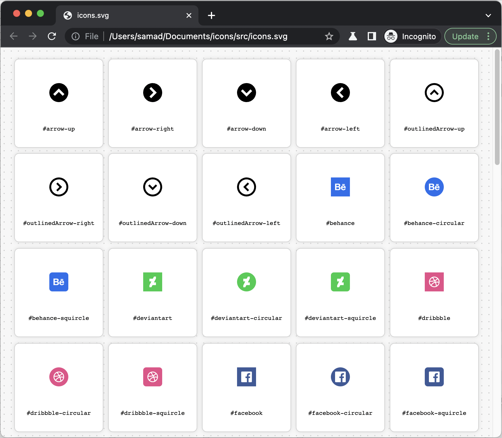

# Combine multiple SVG path groups as symbol, create new icons by rotating/framing/painting them and view them as SVG Icon Table

Combinine multiple SVG path groups as symbols into a single SVG bundle file.
This project aimed to be able to to create a new icon from the same symbol by rotating them or framing them in rectangle, circle or rounded rectangle.
```svg
<symbol id='$arrow'>
    <path d='M 15.989 0 C 28.296 0 35.987 13.332 29.835 24 C 23.681 34.666 8.296 34.666 2.142 24 C 0.74 21.566 0 18.809 0 16 C 0.01 7.166 7.164 0.009 15.989 0 Z M 15.989 14.829 L 22.57 21.414 L 25.396 18.586 L 15.989 9.172 L 6.581 18.586 L 9.407 21.414 L 15.989 14.829 Z' style="fill: rgb(0, 0, 0);"/>
</symbol>
<use href='#$arrow' id='arrow-up'></use>     <-- UP ARROW
<use href='#$arrow' id='arrow-right'></use>  <-- RIGHT ARROW
<use href='#$arrow' id='arrow-down'></use>   <-- DOWN ARROW
<use href='#$arrow' id='arrow-left'></use>   <-- LEFT ARROW
```
The path itself is upside arrow but the other three arrows for the (right, down, left) will be created by rotating the same path on the fly.
Any icon that its ``id`` attribute ended with one of the ``-up``, ``-right``, ``-down``, ``-left`` will rotate at that direction.

You can use the file following its fragment like: ``./relative/path/to/the/icons.svg#arrow-up`` in the web page as an image, embedded file or in the css.


```svg
<symbol id="$twitter"> 
    <path d="M 0 0 L 32 0 L 32 32 L 0 32 Z M 24.96 10.443 C 24.289 10.739 23.577 10.935 22.848 11.023 C 23.617 10.563 24.193 9.839 24.467 8.986 C 23.744 9.415 22.954 9.716 22.129 9.879 C 20.191 7.815 16.745 8.625 15.927 11.335 C 15.824 11.679 15.771 12.035 15.771 12.394 C 15.771 12.676 15.803 12.958 15.865 13.233 C 12.911 13.089 10.156 11.7 8.283 9.412 C 7.313 11.086 7.807 13.226 9.412 14.306 C 8.828 14.288 8.256 14.13 7.744 13.847 L 7.744 13.896 C 7.746 15.646 8.98 17.153 10.696 17.498 C 10.154 17.644 9.587 17.666 9.036 17.562 C 9.516 19.061 10.896 20.087 12.469 20.115 C 11.167 21.133 9.56 21.685 7.906 21.681 C 7.613 21.681 7.32 21.663 7.029 21.628 C 8.712 22.713 10.674 23.287 12.676 23.281 C 19.453 23.281 23.138 17.679 23.138 12.823 C 23.138 12.661 23.138 12.503 23.138 12.345 C 23.854 11.824 24.471 11.18 24.96 10.443 Z" style="fill: rgb(85, 172, 238);"></path>
</symbol>
<use href='#$twitter' id='twitter'></use>          <-- SQUARE
<use href='#$twitter' id='twitter-circular'></use> <-- CIRCULAR
<use href='#$twitter' id='twitter-squircle'></use> <-- ROUNDED SQUARE
```
Fragment ids ``-circular`` and ``-squircle`` will frame the icons into a rounded or rounded square shapes.


# Changing their colors using CSS mask

```html
<!doctype html>
<html>
<head>
    <meta charset="utf-8">
    <title>SVG Icon Map Test</title>

    <style>
        html
        {
            background: antiquewhite;
        }

        .masked
        {
            display: inline-block;
            width: 84px;
            aspect-ratio: 1/1;
            background: black;
            mask: url(./src/icons.svg#youtube-circular) center / contain no-repeat;
            -webkit-mask: url(./src/icons.svg#youtube-circular) center / contain no-repeat;
        }
        #mask-black
        {
            background: black;
        }

        #mask-green
        {
            background: green;
        }
    </style>
</head>
<body>

<div style="with:133px; height: 174px; background: url(./src/icons.svg#youtube-circular) no-repeat;"></div><br>

<div id="mask-green" class="masked"></div><br>

<br><br>

<object type="image/svg+xml" width="84" height="auto" data="./src/icons.svg#youtube"></object><br>

<div id="mask-black" class="masked"></div>

</body>
</html>
 ```

# To view the icons in a table

Additionally, we can view those icons all together as an icon table right in the browser, easily find their IDs and use them.
Jost drag and drop the SVG bundled file into your browser or open it up as a url.


By clicking on any of the icons, its ID would be copied to clipboard automatically.
You can see the IDs right on the bottom of the icons, and in the addressbar. If reload the page, the icon itself will be showed.


